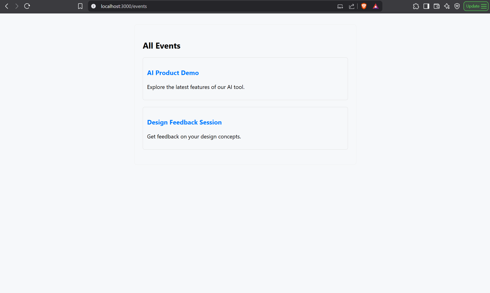
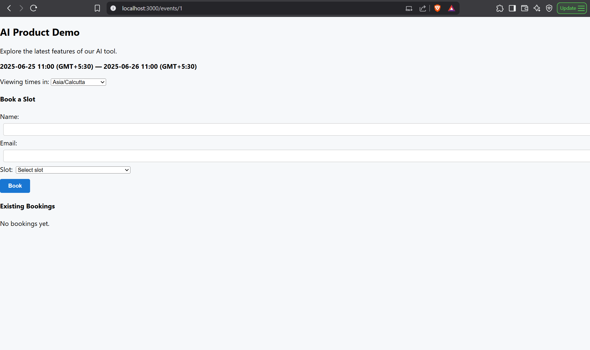
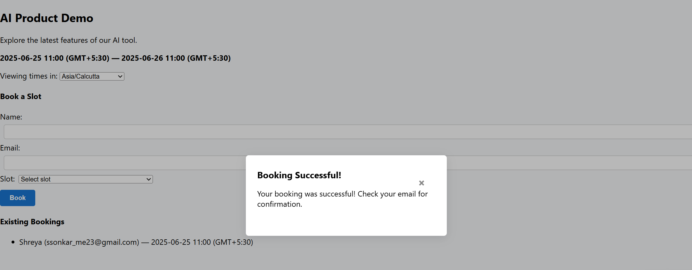
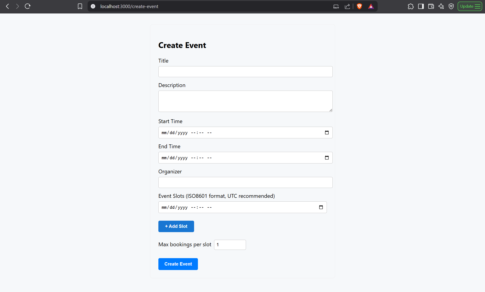
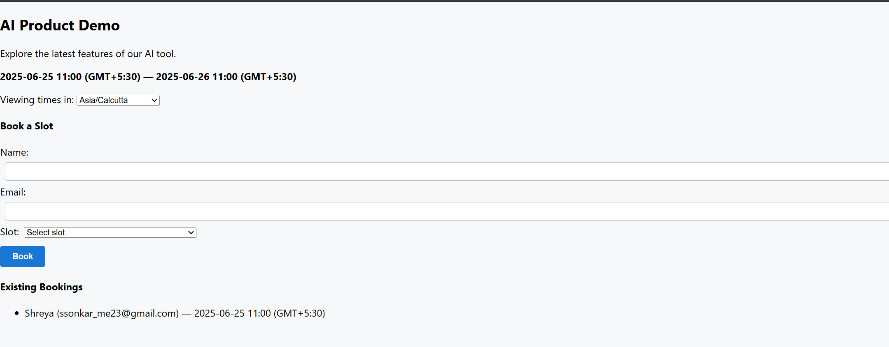
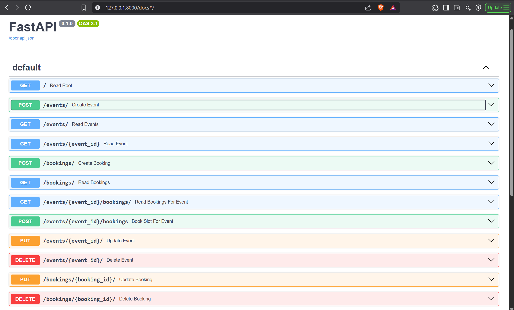

# wiz-hiring-fullstack-2025

A simple, full-stack event scheduling application built with React (frontend), FastAPI (backend), and PostgreSQL database. This project is designed for quick local setup and includes sample data and UI screenshots.


---

## Table of Contents

- [Project Overview](#project-overview)
- [UI Screenshots](#ui-screenshots)
- [Features](#features)
- [Tech Stack](#tech-stack)
- [Folder Structure](#folder-structure)
- [Local Setup & Installation](#local-setup--installation)
- [Running the App Locally](#running-the-app-locally)
- [Usage Guide](#usage-guide)
- [Notes for Reviewers](#notes-for-reviewers)
- [Contact](#contact)

---

## Project Overview

This project is an event scheduling platform built for the WizCommerce Fullstack Hiring Challenge. It demonstrates a modern, modular codebase with clear separation between frontend, backend, and database layers. The app allows users to view available time slots, create events, and book meetings, with all bookings associated with an email address and data persisted in PostgreSQL, making it simple to manage and keep track of scheduled meetings. 

---
## UI Screenshots

| Homepage                         | Booking Modal                    | Confirmation Screen             | Create Event Page                | Bookings by Email                | FastAPI API Docs                   |
|-----------------------------------|----------------------------------|---------------------------------|----------------------------------|-----------------------------------|-------------------------------------|
|  |     |  |  |  |  |

*Screenshots illustrate event discovery, booking modal, meeting confirmation, event creation, viewing bookings for a given email, and the automatically generated FastAPI interactive API documentation (`/docs`).*

---

## Features

- View available time slots for meetings
- Book a meeting in a selected slot
- Create new events through a simple form
- View all bookings and events under the same email address
- Responsive and intuitive UI
- FastAPI backend serving RESTful APIs
- Data persistence with PostgreSQL
- Easy-to-follow local setup
- Double booking a slot is handled
- UI screenshots included for reference

---

## Tech Stack

- **Frontend:** React, CSS
- **Backend:** FastAPI (Python)
- **Database:** PostgreSQL
- **ORM:** SQLAlchemy
- **Other:** Node.js, npm (for frontend dependencies)

---

## Folder Structure

```
wiz-hiring-fullstack-2025/
├── backend/             # FastAPI backend
│   ├── app/             # Main application code
│   └── requirements.txt # Python dependencies
├── frontend/            # React frontend
│   ├── public/
│   └── src/
├── Screenshots/         # UI screenshots for README
├── README.md
└── ...
```

---

## Local Setup & Installation

### Prerequisites

- [Node.js](https://nodejs.org/) and npm
- [Python 3.8+](https://www.python.org/)
- [PostgreSQL](https://www.postgresql.org/) database

### 1. Clone the Repository

```bash
git clone https://github.com/Surabhisonkar/wiz-hiring-fullstack-2025.git
cd wiz-hiring-fullstack-2025
```

### 2. Setup PostgreSQL

- Install and start PostgreSQL locally.
- Remember your DB username, password, and port.

### 3. Backend Setup

```bash
cd backend
pip install -r requirements.txt
# Configure your database connection:
# Create a .env file or edit config as needed:
# DATABASE_URL=postgresql://<username>:<password>@localhost:5432/wizcalendly
# Run you backend
uvicorn app.main:app --reload
```
- The backend will be available at `http://localhost:8000`

### 4. Frontend Setup

Open a new terminal and run:

```bash
cd frontend
npm install
npm start
```
- The frontend will be available at `http://localhost:3000`

### 5. Load Sample Data (Optional)

- If provided, follow instructions in `backend/sample_data/README.md` to populate the database.

---

## Running the App Locally

1. Ensure PostgreSQL is running and the database is set up.
2. Start the backend server (`uvicorn app.main:app --reload`).
3. Start the frontend (`npm start` from `frontend` directory).
4. Open [http://localhost:3000](http://localhost:3000) in your browser.

---

## Usage Guide

-Select an event from the homepage
- Browse available time slots of the selected event.
- Click “Book” on any slot to open the booking modal.
- Confirm your booking; the confirmation screen will show your scheduled event.
- See a list of your bookings by entering the email id.
- All interactions are handled in the UI—no authentication required for this demo.

---

## Notes for Reviewers

- This app is not deployed online; please run it locally using the instructions above.
- UI screenshots are provided for quick reference.
- The codebase is modular and follows best practices for separation.
- If you would like a deployed version or have any questions, I am happy to assist further.

---

## Contact

**Surabhi Sonkar**  
[GitHub](https://github.com/Surabhisonkar)
[LinkedIn](https://www.linkedin.com/in/surabhi-sonkar-b068111b6/)
